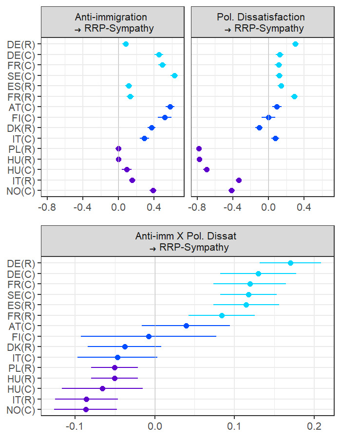
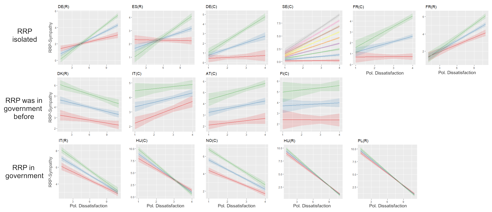

<!-- README.md is generated from README.Rmd -->

# RRPs in Isolation

Radical right-wing populist parties (RRP) have entered most western
parliaments. Existing demand-side research of party success has
highlighted the crucial role of anti-immigration attitudes and political
dissatisfaction as their main drivers of support. Supply-side research
often points at the isolation (cordon sanitaire) such parties face in
their respective parliament. In this research report, we demonstrate
that these perspectives can inform each other and differences in the
parliamentary status of the RRP can predict cross-country differences in
attitudinal effects. We find that besides direct effects,
anti-immigration attitudes and political dissatisfaction vary
considerably in their effect on RRP sympathy. This variation coincides
with the status of RRP in the respective country. In parliamentary
isolation, political dissatisfaction reinforces the effect of
anti-immigration attitudes, while it reduces it when the RRP is
governing and turns insignificant if the RRP has a history of governing.

Please see the manuscript in this folder for the complete draft.

## Visualizations of main results

Figure 1: Forest plot visualizing standardized results of multivariate
multi-group structural equation models. The plots are separated by
variables and grouped by countries within each plot. Letters in
parentheses indicate the origin of the data, C for the CSES data set, R
for the REC data set. The order of the countries follows the position of
the RRP and is furthermore highlighted by colors: light blue denotes
countries in which the RRP is isolated, dark blue dots are used for
countries in which the RRP was part of a cabinet or supported a minority
government before. Purple indicates countries in which the RRP was
governing during the fieldwork period.

Figure 2: These charts show the effect of dissatisfaction on sympathy
for the RRP for different levels of anti-immigration attitudes (blue =
arithmetic mean, red = mean -1SD, green = mean +1SD). Letters in
parentheses refer to the data set (C for CSES, R for RECONNECT). For
Sweden (C) the index of anti-imigration attitudes misses one variable,
thus it has only nine levels, which are all displayed by different
colors (red = lowest, grey = highest). The countries are grouped in rows
by the status of the RRP in the respective country, as indicated at the
left of the panels.

------------------------------------------------------------------------

Please cite the complete manuscript, available in this folder, when
referring to this research as:

Kleinert, Manuel (2022): The Interdependency between Party Isolation and
Predictors of Sympathy with Parties of the Radical Right, working paper.
